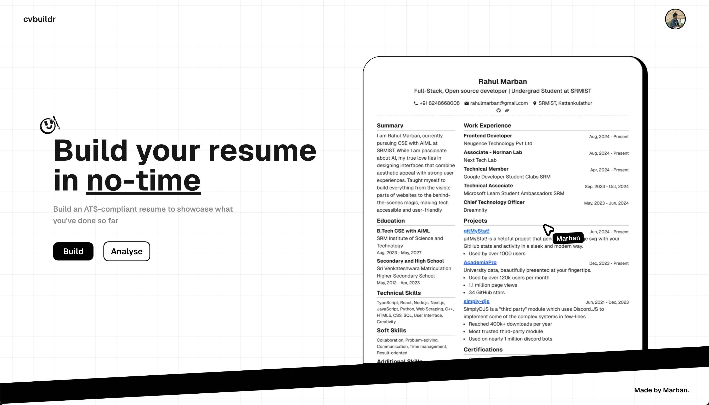

cvbuildr
## Build your resume in no-time
#### Build an ATS-compliant resume to showcase what you've done so far

- Build a professional resume by just typing out, drag and dropping items and craft your own.
- Analyse your resume on the spot, even when downloading to check if it suits you the best.
- Uses AI to analyse and give suggestions to your resume

> Uses `zero-shot-classification` from `facebook/bert-large-mnli` and `Gemini` to format and analyse the data and grade your resume.